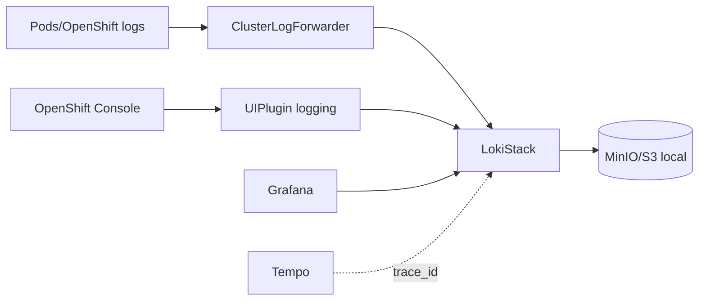

# loki-gitops

Repositório GitOps responsável pela instalação do **Loki Operator (Red Hat)** e
provisionamento do **LokiStack** em ambiente OpenShift 4.x.

Este projeto segue modelo declarativo com Kustomize e integração nativa com
Argo CD/OpenShift GitOps.


## Arquitetura



O Loki recebe logs do OpenShift, armazena em backend S3 compatível no laboratório
e é consultado pelo Grafana para logs e correlação logs-traces. O recurso
`UIPlugin/logging` habilita o menu `Observe > Logs` no Console do OpenShift.

Este LokiStack é para logs de aplicação/infra/audit. Fluxos de rede do Network
Observability usam um LokiStack dedicado no repositório
`network-observability-gitops`, com tenant `openshift-network`.

## Objetivo

Provisionar:

- Loki Operator (via OLM)
- LokiStack
- OpenShift Logging Operator e `ClusterLogForwarder`
- `UIPlugin/logging` para o menu `Observe > Logs`
- Estrutura base para regras de alerta e gravação

## Estrutura

```text
loki-gitops/
├── base/
├── overlays/
│   ├── desenvolvimento/
│   ├── aceite/
│   └── producao/
├── docs/
└── README.md
```

## Operadores

- Package: loki-operator
- Source: redhat-operators
- Channel: stable-6.4
- Namespace obrigatório: openshift-operators-redhat

---

## Deploy

```bash
export MINIO_ROOT_USER=minio
export MINIO_ROOT_PASSWORD='use-a-random-password'

oc -n openshift-logging create secret generic minio-credentials \
  --from-literal=root-user="$MINIO_ROOT_USER" \
  --from-literal=root-password="$MINIO_ROOT_PASSWORD"

oc -n openshift-logging create secret generic loki-s3 \
  --from-literal=access_key_id="$MINIO_ROOT_USER" \
  --from-literal=access_key_secret="$MINIO_ROOT_PASSWORD" \
  --from-literal=bucketnames=loki \
  --from-literal=endpoint=http://minio.openshift-logging.svc:9000 \
  --from-literal=region=us-east-1

oc apply -k overlays/desenvolvimento
```

Os Secrets não são versionados. Para ambientes compartilhados, prefira
External Secrets ou Sealed Secrets e rotacione qualquer credencial que já
tenha sido publicada no histórico Git.

Após a sincronização, valide o plugin de logs:

```bash
oc get uiplugin logging
oc get consoleplugin | grep logging
oc get consoles.operator.openshift.io cluster -o jsonpath='{.spec.plugins}{"\n"}'
```

No Console do OpenShift, faça refresh ou logout/login e acesse
`Observe > Logs`.

## Diagnóstico do menu Observe > Logs

O plugin do Console carrega um `plugin-manifest.json` e uma configuração JSON.
Se o navegador receber HTML nesses endpoints, a UI pode exibir erro de parsing
JSON. Valide primeiro os objetos do cluster:

```bash
oc get uiplugin logging
oc get consoleplugin logging-view-plugin
oc get consoles.operator.openshift.io cluster -o jsonpath='{.spec.plugins}{"\n"}'
```

Depois valide o Loki gateway usado pela UI. Use um token válido no shell, sem
registrá-lo em arquivo:

```bash
TOKEN="$(oc whoami --show-token)"
oc -n openshift-logging run loki-labels-check --rm -i --restart=Never \
  --image=curlimages/curl:8.10.1 -- \
  curl -ksS -H "Authorization: Bearer ${TOKEN}" \
  https://loki-gateway-http.openshift-logging.svc.cluster.local:8080/api/logs/v1/application/loki/api/v1/labels
```

Se os objetos e o gateway estiverem saudáveis, faça hard refresh no navegador.
Quando o Console mantiver bundle antigo em cache, reinicie apenas o Console:

```bash
oc -n openshift-console rollout restart deployment/console
oc -n openshift-console rollout status deployment/console --timeout=5m
```

## Ambientes e validação

```bash
oc kustomize overlays/desenvolvimento >/tmp/loki-dev.yaml
oc kustomize overlays/aceite >/tmp/loki-aceite.yaml
oc kustomize overlays/producao >/tmp/loki-prod.yaml
oc apply --dry-run=client -k overlays/desenvolvimento
```

A estrutura primária é `base/` e `overlays/{desenvolvimento,aceite,producao}`.
`storageClassName` não é fixado na base; o overlay `desenvolvimento` mantém a
classe do CRC para não alterar PVCs já criados no laboratório. Veja
`docs/AMBIENTES.md`.
